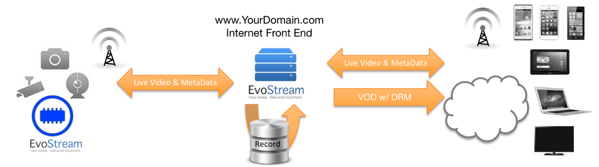

本文書はEvoStream Media Server(EMS)の使用説明書です。サーバーの起動方法などの基本的から設定ファイルの編集方法といった応用までを網羅しています。

本文書はEMSのユーザー向けで、読者はマルチメディアストリーミングおよびその周辺技術についてのおおまかに理解されていることを前提に書かれています。

##EMSとは？
EvoStreamはライブおよびオンデマンドでコンテンツをさまざまなスクリーンに届ける低コストなエンタープライズ向けメディアサーバーです。EvoStreamをつかえば、Adobe Flash、Apple iOSデバイスおよびQuickTime、IPTV、Microsoft Silverlight、Android、Blackberry、その他3GPPデバイス向けにひとつのワークフローでオーディオ／ビデオ／データ配信を行うことができます。

##なぜEMSが選ばれるのか?

EvoStreamのユニークなアーキテクチャは、他のJavaベースのメディアサーバーと比較して高いI/Oパフォーマンスを発揮し、組み込みデバイス（各種エンコーダー、IPカメラ、DVRその他）を含む、実質的にほぼすべてのプラットフォーム(Linux, Windows, Mac OSX等)上で稼働させることができる唯一のメディアサーバーです。

##EMSの特徴とメリット
EvoStream Media Serverは単なるマルチフォーマット・マルチプロトコルサーバーというだけでなく、多数のスクリーンやプラットフォームへリッチメディアコンテンツを配信することができます。またエンタープライズ向けの低コストな配信サーバーです。EvoStreamは業界で最も高効率かつフレキシブルなストリーミングメディアサーバーといえます。

- **次世代ストリーミング**
HTML5ブラウザにダイレクトに低遅延にストリーム配信可能です。プラグインやカスタムアプリを別途インストールする必要はありません。ピア・ツー・ピアストリーミングは運用コストを低減します。リアルタイムにフレーム付随するメタデータを配信可能。

- **高効率性**
EMSはCPU性能およびメモリ消費が少なく、Intel CPUコアあたり **約2000もの同時配信数**を取り扱うことができます。つまり帯域の上限に到達するまでにハードウェアリソースを使い切るということはまずありません。

- **拡張性**
アプリケーションやインフラに合わせてサーバー機能を拡張するのにカスタムモジュールをひとつずつ開発したり、特定のプログラム言語に縛られる必要はありません。EMSには、HTTPコール、PHP、Lua、C++向けを含む多様なランタイムAPIセットが用意されていますので、既存のワークフローにすぐに簡単に組み込むことが可能です。

加えて、EMSではイベント通知システムも用意されていますので、EMSの動作を確認できます。ストリームルーティングの自動化、HLSやHDSのダイナミック生成、簡易なRESTfulモニターをつかってのサーバーアクティビティの監視などが行なえます。

- **クロスプラットフォーム**
プラットフォーム非依存で、ipカメラやDVRなどの組み込みシステムを含む数多くのOS上で動作可能です。

- **スケーラビリティ**
少数から数千といったオーダーの用途にも、ライブやオンデマンドストリーミングのどちらでも、堅牢かつ負荷分散された配信を行うことができます。コストを抑えつつインフラを無限に拡張できます。

- **堅牢性**
EMSは高トラフィック環境で検証されており、最大限の動作可能時間と信頼性を必要とする世界中のエンタープライズコンテンツ配信プロバイダに実運用されています。

##EMSはどのように動作するのか
EvoStream Media Serverは独立して実行されるアプリケーションで、ユーザがビデオ・オーディオストリームを送る先となります。さらにユーザはEMSに様々な再生プレーヤーやサーバーからEMSに接続することができ、ランタイムAPIをつかってストリームをpushしたり新しいストリームをpull inしたりすることができます。

- **ストリームルーティング**
EvoStreamが備える充実したAPIには **pull/pushストリーミング機能** がありますので、ユーザはRTMP/RTSP/HLS/MPEG-TSその他のストリームをCDNやサービスプロバイダなどとの間で簡単に取り込んだり(pull)、送り出したり(push)といった事が簡単にできます。

## EMSが動作するOS環境は？
事実上すべてのOSといってもいいでしょう。Windows, Linux, Mac OSX, BSD, Solaris上で動作します。堅牢なサーバーからARMベースのIPカメラまでどんな環境でも動作可能です。
EMSが動作するOSは：
- Windows:  10x64, 8.1x64, 8x64, 7x64, Server 2008x64, Server2012
- Linux: Debian, CentOS, RedHat, Ubuntu, openSUSE等
- Mac OSX
- FreeBSD
- OpenBSD
- Raspbian

**Note:** v1.7.1以降ではEMSは64bitマシンのみサポートされます