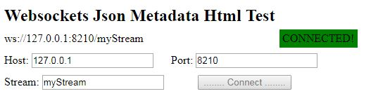
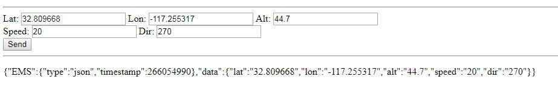
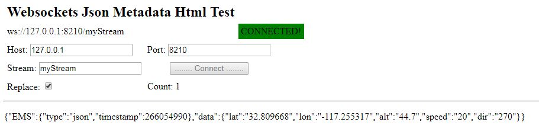

メタデータの送受信のデモページは..evo-webroot/demo/にあります。


## jsonMetaWriteTest.html

このデモページはいくつかのストリーム設定を使用しメタデータをストリーム内に入れて送信します。


1.  `demo/jsonMetaWriteTest.html`テストページにアクセスしてください。

   ```
   http://<EMS_IP>:<WebserverPort>/demo/jsonMetaWriteTest.html
   http://127.0.0.1:8888/demo/jsonMetaWriteTest.html
   ```

2.  **Host**、 **Port**、 **Stream**をそれぞれ入力してください:

   

   ​

   **Note:** stream ~0 ~ 0 ~ 0 ~の部分はすべてのストリームに書き込むことを意味します

   ​

3. **Connect**ボタンをクリックしてください

   

   ​

4. ストリーム設定の詳細情報を編集し、click **Send**ボタンをクリックしてください。

   

   ​

   ​


## jsonMetaTest.html

このデモページはストリームからメタデータを読みます


1. `demo/jsonMetaTest.html`テストページにアクセスしてください。

   ```
   http://<EMS_IP>:<WebserverPort>/demo/jsonMetaTest.html
   http://127.0.0.1:8888/demo/jsonMetaTest.html
   ```

   ​

2. **Host**、 **Port**、 **Stream**をそれぞれ入力してください:

   

   ​

   **Note:** stream ~0 ~ 0 ~ 0 ~の部分はすべてのストリームからメタデータを読み取ることを意味します

   ​

3. **Connect**ボタンをクリックしてください

   

   ​

4. ストリームに送られたメタデータが表示されますe:

   


**Note:**

 jsonMetaTestページはメタデータを送る前に開いてください。ページが開く前に送られたメタデータは表示しません。
